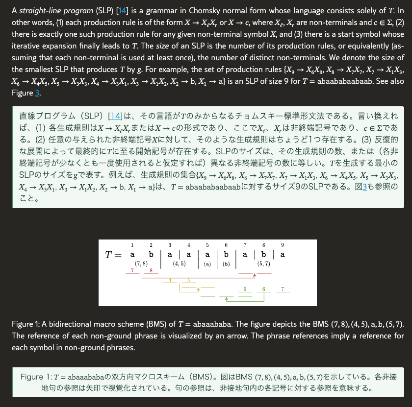

# bilingual-paper

Bilingual (English + target language) HTML versions of arXiv HTML papers and PDF papers, translated with Gemini.

Each paragraph, heading and caption of the original document is followed by its translation, with all original
structure, CSS and MathML preserved:



## arXiv HTML papers

`bilingual-paper arxiv` handles arXiv's own HTML papers (`https://arxiv.org/html/<id>`, LaTeXML output). Because
the source is already structured HTML, it extracts paragraphs/headings/captions straight from the DOM (inline
MathML included), translates each once via Gemini, and inserts the translation (`--target-lang`, default `ja`) directly under its
English counterpart in the original document, preserving all original structure, CSS and MathML.

```bash
uv sync
uv run bilingual-paper arxiv 2307.01412
uv run bilingual-paper arxiv https://arxiv.org/abs/2307.01412v4
uv run bilingual-paper arxiv path/to/saved-arxiv-page.html --target-lang ko
uv run python -m unittest discover -s tests -v
uv run ruff check .
uv run ruff format .
uv run pyright
```

`SOURCE` may be a bare arXiv ID, an `arxiv.org/abs|pdf|html/...` URL (fetched directly from arXiv), or a local
HTML file already saved from an arXiv HTML page. Output defaults to `outputs/<slug>-<lang>-bilingual.html` and the
translation checkpoint to `work/<slug>/<lang>/translations.json` (both overridable with `--output`/`--checkpoint`), so
runs in different languages never overwrite or reuse each other; see
`--help` for all options. See `docs/arxiv-bilingual-html.md` for the full procedure this script implements.

`--target-lang` (default `ja`) picks the translation language; see `src/bilingual_paper/languages.py` for the
supported codes (`ja`, `ko`, `zh-Hans`, `zh-Hant`, `fr`, `de`, `es`, ...). Arabic output is rendered right-to-left.
When this pipeline is run on someone's behalf from a chat session, the target language should be inferred from the
language the request was written in (e.g. a Korean request implies `--target-lang ko`), not left at the `ja` default.

`bilingual-paper arxiv` calls Gemini (`gemini-flash-lite-latest` by default) through Vertex AI, authenticated with
local Application Default Credentials rather than an API key:

```bash
gcloud auth application-default login
export GOOGLE_CLOUD_PROJECT=<your-gcp-project>
# optional, defaults to "global":
export GOOGLE_CLOUD_LOCATION=us-central1
```

Transient Gemini errors (5xx/429, empty or unparseable replies) are retried with backoff, and a batch whose reply
drops or duplicates IDs is redone one segment at a time.

## PDF papers

`bilingual-paper pdf` handles papers that have no arXiv HTML version. An external layout-analysis tool first converts the
PDF to Markdown with LaTeX math ([MinerU](https://github.com/opendatalab/MinerU) by default, or
[docling](https://github.com/docling-project/docling) with `--converter docling`); it recovers reading order across
columns, paragraphs split by column/page breaks, lists, code, tables, figures and formulas. Each heading, paragraph and
list item is then translated exactly like an arXiv page, and formulas are typeset with MathJax.

```bash
uv tool install "mineru[core]"   # or: uv tool install docling
uv run bilingual-paper pdf path/to/paper.pdf --target-lang ja
```

The converter's Markdown is cached in `work/<slug>/<converter>/` (`--reconvert` to redo it), and `--converter-arg`
passes extra options through (e.g. `--converter-arg=--ocr-mode --converter-arg=ocr` for a scanned PDF). Prefer
`bilingual-paper arxiv` when the paper has an arXiv HTML version: its math and tables are exact, while a PDF converter's
formula recognition can add stray symbols. See `docs/pdf-bilingual-html.md` for details and known limitations.

## License

MIT — see [LICENSE](LICENSE).
